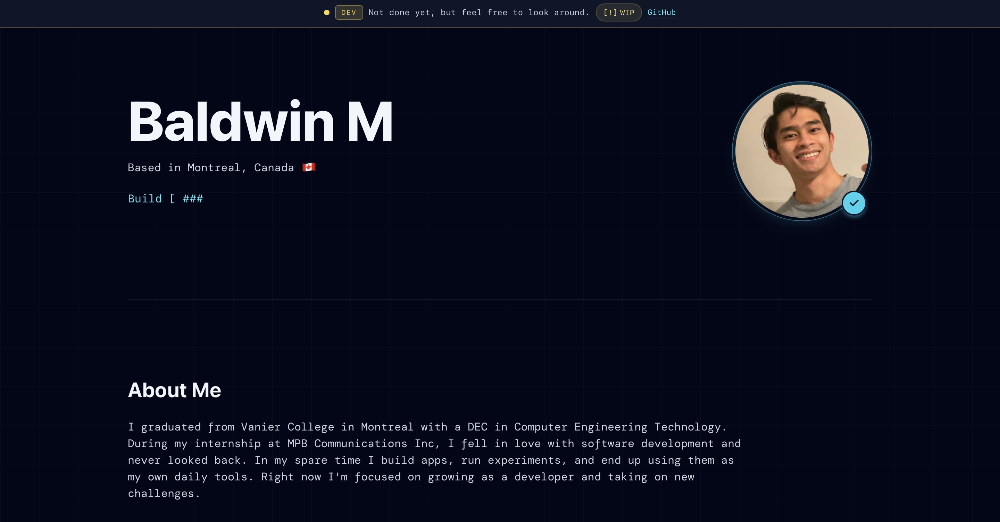

# code_notes

`code_notes` is a personal portfolio-style app for showing projects, profile content, iOS app pages, and site announcements.

## Screenshot

## Frontend

The frontend shows the portfolio pages, iOS project pages and announcement UI.

## Backend

The backend is an Express server that serves API routes and returns data to the frontend.

## Database

This project uses a Neon PostgreSQL cloud database for profile data, project data, and site config such as announcements and WIP items.

## OnRender

OnRender is used to run the deployed app services online.
